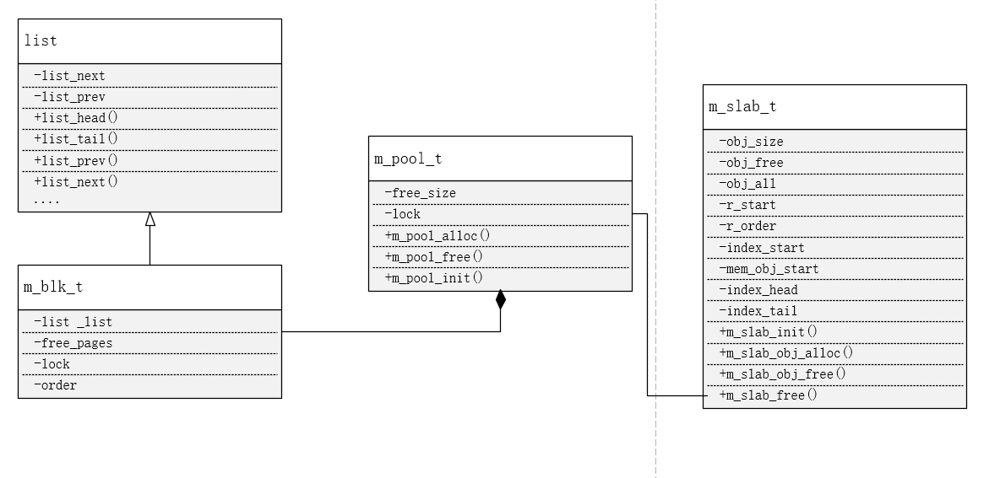

# 需求分析

需求分析十分明确，使用C语言实现，free-standing的分配内存的库, 将配置文件和移植需要改动的参数放到对应的文件里面

## 功能性需求

- 实现接口 - m_pool_alloc(m_pool_t* handler,int order);
- 实现接口 - m_pool_free(m_pool_t* handler,void* start,int order);
- 实现接口 - m_pool_init(m_pool_t* handler,void* start,int length);
- 实现接口 - m_slab_t* m_slab_init(void* start,int order,int obj_size);
- 实现接口 - void m_slab_free(m_slab_t* slab_handler,m_pool_t* pool_handler);
- 实现接口 - void*  m_slab_obj_alloc(m_slab_t* slab_handler);
- 实现接口 - void m_slab_obj_free(m_slab_t* slab_handler,void* start_addr);

## 非功能性需求

- free-standing : 不需要依赖任何的OS环境，只需要依赖 C99 以上的编译器
- 资源可配置
- 移植性比较好
- 支持并发
- 性能希望比较好

（有待改进，buddy_allocator 的时间分配复杂度为O(1)，释放复杂度O(N) ,和之前的版本的均O(1)相比，性能更差了，但是不依赖于某块固定的bit位图空间，移植性提高)

## 设计思路

- 功能性需求的接口已经规定好了入口参数，根据个人的实践经验，pool_handler 需要能够分配不同order阶数的页，每个order除了表示不同阶数的页不同外，没有任何区别，所以，我们可以为每个order 建模分配器。
- 设计UML图

